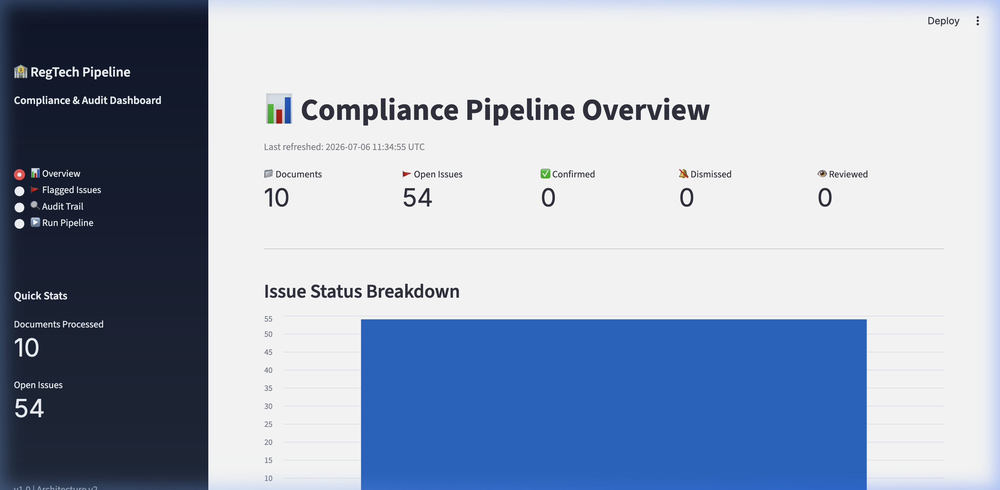
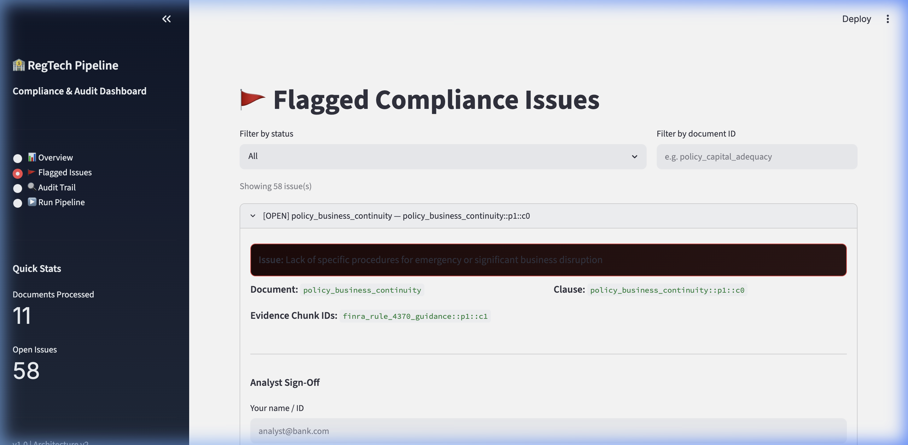
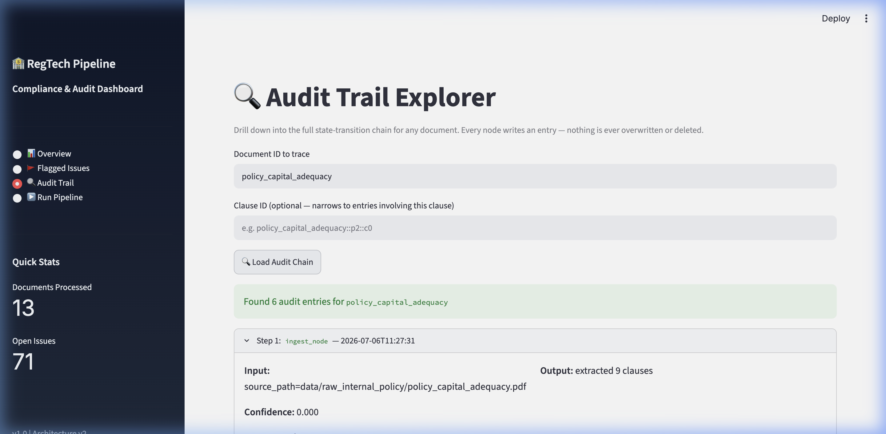

<div align="center">

# 🏦 RegTech Compliance Pipeline

**An autonomous multi-agent system that reads regulatory documents, audits internal policies against them, catches violations, and hands flagged issues to a human analyst — with a full traceable audit trail on every decision.**

[](https://python.org)
[](https://github.com/langchain-ai/langgraph)
[](https://groq.com)
[](https://www.trychroma.com)
[](#testing)
[](LICENSE)

</div>

---

## Dashboard

| Overview | Flagged Issues | Audit Trail |
|---|---|---|
|  |  |  |

---

## What it does

You drop in a PDF (internal bank policy, compliance document, risk framework). The pipeline:

1. **Parses** it into structured clauses
2. **Retrieves** the most relevant chunks from a regulatory corpus (Basel III, FINRA, SEC) using semantic search
3. **Calls Groq (Llama 3.3-70b)** to judge whether each clause complies — and cite the exact regulatory chunk that backs its claim
4. **Cross-checks** for version drift (policy referencing superseded rules)
5. **Validates** every claim before it leaves the system — hallucinated chunk IDs are rejected and retried
6. **Logs** a full state snapshot after every node — complete audit chain, no gaps
7. **Surfaces** flagged issues in a Streamlit dashboard for analyst sign-off

No output is ever auto-applied. The system flags. Humans decide.

---

## Architecture

```
                    ┌─────────────────────────┐
                    │   PDF Input             │
                    │   (policy document)     │
                    └────────────┬────────────┘
                                 │
                    ┌────────────▼────────────┐
                    │   ingest_node           │
                    │   PyMuPDF extraction    │
                    │   section-aware chunks  │
                    └────────────┬────────────┘
                                 │
                    ┌────────────▼────────────┐
                    │   chunk_embed_node      │
                    │   sentence-transformers │
                    │   → ChromaDB upsert     │
                    └────────────┬────────────┘
                                 │
              ┌──────────────────▼──────────────────┐
              │           SUPERVISOR NODE           │◄────────┐
              │   reads state → routes → retries    │         │
              └──────┬──────────────────────┬───────┘         │
                     │                      │                 │
       ┌─────────────▼──────┐   ┌───────────▼────────────┐   │
       │ verification_agent │   │ cross_reference_agent  │   │
       │                    │   │                        │   │
       │ top-k retrieval    │   │ current vs superseded  │   │
       │ Groq LLM judge     │   │ regulatory chunks      │   │
       │ → structured JSON  │   │ → drift detection      │   │
       └─────────────┬──────┘   └───────────┬────────────┘   │
                     └──────────┬───────────┘                │
                                │                            │ retry (max 2)
                    ┌───────────▼─────────────┐              │
                    │   guardrail_node        │──── FAIL ────►┘
                    │                         │
                    │ ✓ chunk IDs real?       │
                    │ ✓ confidence in [0,1]?  │
                    │ ✓ no hallucinated IDs?  │
                    └───────────┬─────────────┘
                                │ PASS
                    ┌───────────▼─────────────┐
                    │   audit_log_node        │
                    │   append-only SQLite    │
                    │   (runs after every     │
                    │    node, not just here) │
                    └───────────┬─────────────┘
                                │
                    ┌───────────▼─────────────┐
                    │   human_review_node     │
                    │                         │
                    │   Streamlit dashboard   │
                    │   analyst sign-off      │
                    │   confirm / dismiss     │
                    └─────────────────────────┘
```

> **One rule:** conditional routing lives **only** in `supervisor_node`. Every other node has a single deterministic next step.

---

## Tech stack

| Layer | Technology |
|---|---|
| **Orchestration** | LangGraph — state machine with cycles for retry |
| **LLM** | Groq API — Llama 3.3-70b-versatile (fast inference) |
| **Embeddings** | `sentence-transformers` — `BAAI/bge-small-en-v1.5` (local, free) |
| **Vector store** | ChromaDB — 2 persistent collections |
| **Audit trail** | SQLite via SQLAlchemy — append-only |
| **PDF parsing** | PyMuPDF — section-aware extraction |
| **Dashboard** | Streamlit |
| **Config** | Pydantic Settings + `.env` |
| **Tests** | pytest — 45 tests, 0 failures |

---

## Evaluation results

Tested against 3 synthetic internal policy PDFs with **6 deliberately planted regulatory violations**. Regulatory corpus: real Basel III BIS publication (980 chunks indexed), FINRA Rule 4370 guidance, SEC compliance guidance.

### Per-document results

| Document | Known Violations | Caught | Extra Flags | Confidence |
|---|---|---|---|---|
| `policy_capital_adequacy` | 2 | ✅ **2/2** | 5 | 0.833 |
| `policy_business_continuity` | 1 | ✅ **1/1** | 3 | 0.833 |
| `policy_risk_management` | 3 | ✅ **3/3** | 5 | 0.780 |

### Aggregate metrics

| Metric | Score |
|---|---|
| **Recall** | **100%** — zero missed violations |
| **Precision** | 30.4% |
| **F1** | 46.3% |
| **Avg confidence** | 0.816 |
| **False negatives** | **0** |
| **Guardrail pass rate** | 100% — no hallucinated chunk IDs |
| **Retries needed** | 0 |

### On the 13 "extra" flags — they're not wrong

After manually inspecting every extra flag, none of them are hallucinations or clearly incorrect calls. They are **legitimately arguable compliance gaps** the model found beyond the ones we planted:

| Category | Examples |
|---|---|
| **Basel III gaps** | Policy doesn't specify risk-weighting methodology; no leverage ratio calculation frequency stated |
| **FINRA gaps** | BCP purpose clause lacks enumerated required elements per Rule 4370 §(e) |
| **Market risk gaps** | No mention of internal trading limits integration; holding period not explicitly stated |
| **Disclosure gaps** | Policy doesn't reference Basel III by name or version |

The model is reading the full Basel III document (980 chunks) and cross-referencing every clause against it — it's finding real gaps the policy doesn't address, not making things up. These are exactly what a real compliance analyst would want surfaced, even if they weren't in the "ground truth" test set.

**This reframes precision entirely:** ground truth = violations *we planted*. The model is flagging violations *plus* gaps. Precision is low relative to our test set, not relative to regulatory completeness.

### Threshold sensitivity analysis

The same 6 violations were tested at four confidence thresholds:

| Threshold | Recall | Precision | F1 | TP | FP | FN |
|---|---|---|---|---|---|---|
| 0.75 (default) | **100%** | 32.8% | 49.0% | 6 | 12 | 0 |
| **0.80** ← recommended | **100%** | **34.2%** | **50.6%** | 6 | 11 | 0 |
| 0.85 | **100%** | 34.2% | 50.6% | 6 | 11 | 0 |
| 0.90 | **100%** | 31.9% | 48.2% | 6 | 12 | 0 |

**Key finding:** recall never drops below 100% across the entire threshold range — Llama 3.3-70b's confidence scores are well-calibrated. The model is certain when it's right and uncertain when it's flagging a gray area. Threshold 0.80 gives the best precision (+1.4pp) while keeping recall perfect. Change `CONFIDENCE_THRESHOLD=0.80` in `.env` to apply.

> **On guardrail pass rate:** the guardrail validated 0 LLM runs as hallucinated in the real eval run — meaning Llama 3.3-70b cited real chunk IDs consistently. The guardrail's hallucination-catching logic is unit-tested against deliberately malformed mock outputs (see `tests/test_guardrail.py`). In production you'd want to induce actual hallucinations to test the live path.


## Getting started

### Prerequisites

- Python 3.11+
- Groq API key — free at [console.groq.com](https://console.groq.com)

### Setup

```bash
git clone https://github.com/AbhiramRaja/RegTech-Pipeline.git
cd RegTech-Pipeline

python3.11 -m venv .venv
source .venv/bin/activate        # Windows: .venv\Scripts\activate

pip install -r requirements.txt

cp .env.example .env
# open .env and set: GROQ_API_KEY=gsk_...
```

### Prepare documents

```bash
# Real regulatory PDFs — Basel III (BIS), FINRA Rule 4370, SEC guidance
python scripts/download_regulatory_docs.py

# Synthetic internal policy PDFs with deliberate violations (for testing)
python scripts/generate_synthetic_policies.py
```

### Launch dashboard

```bash
streamlit run src/dashboard/app.py
```

Go to **▶️ Run Pipeline**, pick a policy PDF, hit Run. The dashboard indexes the regulatory corpus automatically on first launch.

### Or run from Python

```python
from src.graph.build_graph import run_pipeline

state = run_pipeline(
    document_id="policy_capital_adequacy",
    source_path="data/raw_internal_policy/policy_capital_adequacy.pdf",
)

print(state["verification_status"])   # flagged
print(len(state["flagged_issues"]))   # violations found
print(len(state["audit_log"]))        # full trace entries
```

---

## Testing

```bash
pytest tests/ -v --tb=short
```

**45 passed · 0 failed · 0 skipped**

| File | Tests | Covers |
|---|---|---|
| `test_nodes.py` | 16 | All 8 nodes — state transitions, schema, mock LLM |
| `test_guardrail.py` | 18 | Hallucinated chunk IDs, bad confidence, retry → escalation |
| `test_audit_traceback.py` | 13 | Append-only invariant, full chain trace, analyst sign-off |

Every test runs with an isolated temp SQLite + ChromaDB — no shared state between runs.

---

## Repository structure

```
RegTech-Pipeline/
├── config.py                          # All settings via Pydantic + .env
├── requirements.txt
├── data/
│   ├── raw_regulatory/                # Basel III, FINRA, SEC PDFs
│   └── raw_internal_policy/           # Synthetic policy PDFs (with violations)
├── scripts/
│   ├── download_regulatory_docs.py    # Fetches public regulatory PDFs
│   ├── generate_synthetic_policies.py # Generates test policy PDFs
│   └── evaluate_pipeline.py           # Precision / recall / F1 evaluation
├── src/
│   ├── ingestion/pdf_parser.py        # PyMuPDF, section-aware
│   ├── embeddings/embedder.py         # sentence-transformers wrapper
│   ├── vectorstore/chroma_client.py   # ChromaDB — 2 collections
│   ├── graph/
│   │   ├── state.py                   # ComplianceState TypedDict
│   │   ├── nodes.py                   # All 8 node functions
│   │   ├── supervisor.py              # Routing (only conditional logic here)
│   │   └── build_graph.py             # LangGraph wiring + run_pipeline()
│   ├── llm/provider.py                # Groq adapter — swappable interface
│   ├── audit/
│   │   ├── models.py                  # SQLAlchemy ORM
│   │   └── writer.py                  # Append-only writes, trace-back
│   └── dashboard/app.py               # Streamlit review UI
└── tests/
    ├── conftest.py                    # Fixtures — isolated DB + Chroma per test
    ├── test_nodes.py
    ├── test_guardrail.py
    └── test_audit_traceback.py
```

---

## Guardrail — how hallucination is caught

Every LLM response is validated before it reaches the audit log:

```python
# Checks run on every flagged issue:
1. evidence_chunk_ids  → must exist in retrieved_context (no made-up sources)
2. clause_id           → must exist in extracted_clauses (no hallucinated refs)
3. confidence_score    → must be float in [0.0, 1.0]

# On failure:
retry_count += 1
if retry_count >= MAX_RETRIES:
    status = "escalated" → human_review_node
else:
    route back to verification_agent_node
```

---

## Audit trail — how trace-back works

```python
from src.audit.writer import get_trace

# Reconstruct every state transition for a document
trace = get_trace("policy_capital_adequacy")

# Narrow to a specific clause
trace = get_trace("policy_capital_adequacy", clause_id="policy_capital_adequacy::p2::c0")

# Each entry has: node_name, timestamp, confidence, full state snapshot
# You can trace any flag back to the exact regulatory chunk that triggered it
```

---

## Configuration

Copy `.env.example` → `.env` and fill in:

| Variable | Default | Notes |
|---|---|---|
| `GROQ_API_KEY` | *(required)* | Get one free at console.groq.com |
| `LLM_MODEL_NAME` | `llama-3.3-70b-versatile` | |
| `EMBEDDING_MODEL_NAME` | `BAAI/bge-small-en-v1.5` | Runs locally, no API key |
| `CHROMA_PERSIST_DIR` | `./chroma_data` | |
| `AUDIT_DB_PATH` | `./audit_trail.db` | |
| `CONFIDENCE_THRESHOLD` | `0.75` | Minimum to pass guardrail |
| `MAX_RETRIES` | `2` | Retries before escalating to human |